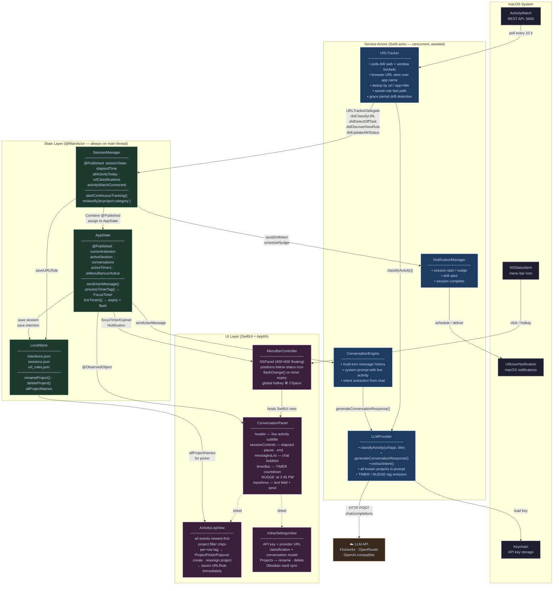

# Steady — Architecture

## Diagram

---

## How it works — for someone new to Mac development

### What kind of app is this?

Steady is a **menu bar app** — it lives as a small icon in the macOS menu bar rather than in the Dock. There is no traditional app window; instead a floating panel (`NSPanel`) drops down when you click the icon. This pattern is common for lightweight Mac utilities that run quietly in the background.

### The tracking pipeline

Every 10 seconds, `URLTracker` calls ActivityWatch's local REST API (`http://localhost:5600`). ActivityWatch is a separate open-source background process that captures which browser tab is open and which app is frontmost — Steady simply reads that data.

If the frontmost app is a browser, Steady uses the web watcher event (which has the actual URL). If it's a native app like Xcode or Figma, it synthesizes an `app://Xcode` identifier instead. Either way it ends up with a `(url, title)` pair.

That pair is classified by the LLM — unless a saved URL rule already covers it, in which case classification is skipped entirely (fast path). The result flows through a **delegate** back to `SessionManager`, which appends it to `allActivityToday`.

### Swift concurrency — actors vs `@MainActor`

Two isolation patterns appear throughout the codebase:

**`actor`** (`URLTracker`, `LLMProvider`, `ConversationEngine`) — Swift guarantees only one piece of code runs inside an actor at a time, preventing data races when multiple network responses arrive concurrently. You `await` to call into them from any thread.

**`@MainActor`** (`AppState`, `SessionManager`, `LocalStore`) — these classes are pinned to the main thread. This is required because SwiftUI reads `@Published` properties on the main thread. When an actor finishes work, it hops back to main with `Task { @MainActor in ... }` before updating state.

### The chat pipeline

When you type a message, `AppState.sendUserMessage` bundles the current intention, recent activity classifications, and conversation history into a `ConversationContext`, then calls `ConversationEngine`. The engine maintains the full message history and sends it to `LLMProvider`, which makes an HTTP POST to the configured endpoint using the OpenAI chat completions format — so it works with Fireworks, OpenRouter, or any compatible provider.

Before the response is displayed, `processTimerTag` scans it for embedded tags:

- `[TIMER:25m:label]` — user-requested; shows a live MM:SS countdown in orange
- `[NUDGE:20m:label]` — LLM-initiated; shows a calm "checking in at 3:45 PM" hint with no countdown

When a timer expires, a `Notification` is posted and `MenuBarController` responds by flashing the status item orange six times.

### Sessions vs. passive tracking

The two concepts are intentionally separate. **Passive tracking** runs constantly from app launch — `URLTracker` polls ActivityWatch and classifies activity regardless of whether a session is active. **Sessions** are an optional annotation layer: starting one adds an `Intention` context to the tracker (so the LLM can judge on-task vs. off-task) and starts an elapsed-time counter. Ending a session strips that context but leaves the tracker running.

### Persistence

Everything is stored locally — no cloud. `LocalStore` writes three JSON files to `~/Library/Application Support/Steady/`. The API key lives separately in the **macOS Keychain** (encrypted secure storage). The optional Obsidian sync writes markdown files directly into your vault folder via `ObsidianSync`.
