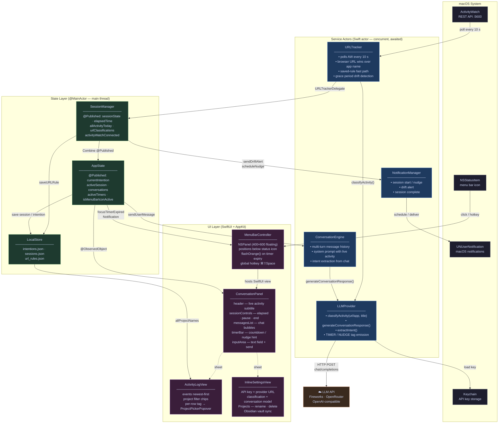

# Architecture

---

## Key Concepts

### Concurrency model

- **`actor`** (`URLTracker`, `LLMProvider`, `ConversationEngine`) — isolated, awaitable; safe for concurrent network work
- **`@MainActor`** (`AppState`, `SessionManager`, `LocalStore`) — pinned to the main thread; required for `@Published` / SwiftUI reads

### Tracking pipeline

Every 10 seconds `URLTracker` polls ActivityWatch's local REST API (`http://localhost:5600`). If a browser is frontmost it uses the web-watcher URL; otherwise it synthesizes `app://AppName`. The `(url, title)` pair is classified by `LLMProvider` — unless a saved URL rule already covers it (fast path). Results flow via `URLTrackerDelegate` to `SessionManager`.

### Chat pipeline

`AppState.sendUserMessage` bundles the current intention, recent classifications, and conversation history into a `ConversationContext`. `ConversationEngine` maintains the full message history and sends it to `LLMProvider` as an OpenAI-compatible `chat/completions` request. Before display, the response is scanned for embedded tags:

- `[TIMER:25m:label]` — shows a live MM:SS countdown in the panel
- `[NUDGE:20m:label]` — shows a calm "checking in at 3:45 PM" hint

### Sessions vs. passive tracking

Passive tracking runs constantly from launch. A session is an optional annotation layer: it adds an `Intention` context (so the LLM can judge on/off-task) and starts an elapsed-time counter. Ending a session strips the context but leaves the tracker running.

### Persistence

All data is stored locally in `~/Library/Application Support/Steady/` as JSON. The API key lives in the macOS Keychain. Obsidian sync writes Markdown files directly into the configured vault folder.
